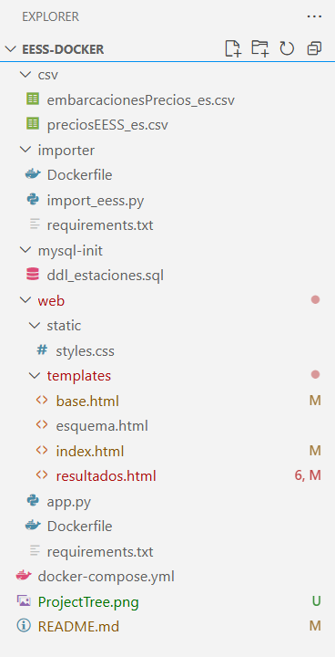
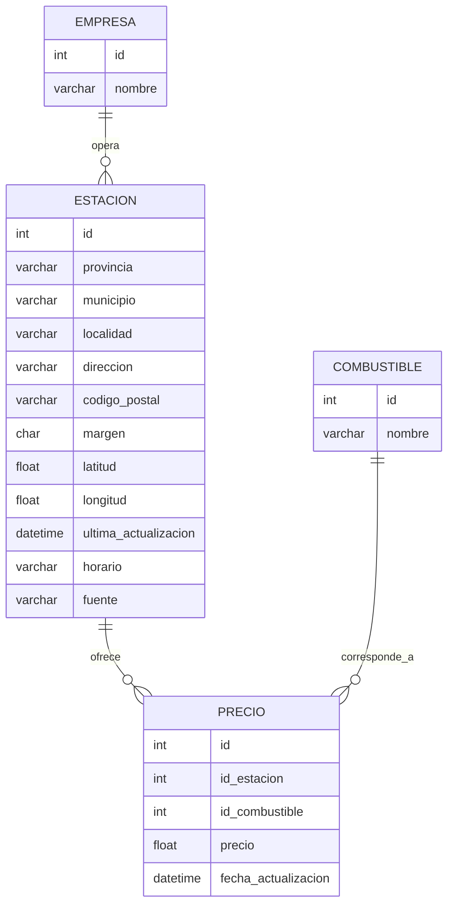

# Estaciones de Servicio Terrestres y Marítimas

## Descripción general

Este proyecto implementa una base de datos y una interfaz web para **gestionar, consultar y visualizar información sobre estaciones de servicio terrestres y marítimas** en España.  

Integra los datos oficiales del Ministerio de Industria (archivos `preciosEESS_es.csv` y `embarcacionesPrecios_es.csv`), y permite realizar consultas sobre precios, ubicaciones y operadores de las estaciones.

El entorno está completamente **contenedorizado con Docker**, lo que garantiza portabilidad y facilidad de despliegue.

---

## Arquitectura del sistema

El proyecto se compone de tres servicios principales, definidos en `docker-compose.yml`:

| Servicio | Rol | Imagen base | Puerto |
|-----------|------|-------------|---------|
| `db` | Base de datos MySQL 8.0 | `mysql:8.0` | 3306 |
| `importer` | Carga los ficheros de datos (.csv) en la base de datos | `python:3.11-slim` | — |
| `web` | Interfaz Flask + Leaflet para visualizar consultas | `python:3.11-slim` | 5000 |

### Diagrama de arquitectura

---

 ```mermaid
  graph LR
    A[CSV Ministeriales] -- se importan a: --> B((ImporterPython))
    B --> C(MySQL DB + Flask + Leaflet)
    D[Frontend Web] --> C
    U[Usuario / Navegador]-->|HTTP| D
  ```

 
 ## ⚙️ Instalación y despliegue

### Requisitos previos

Docker Desktop instalado y en ejecución.

Al menos 4 GB de RAM libre (para MySQL + Python).

Los archivos de datos:

preciosEESS_es.csv → estaciones terrestres

embarcacionesPrecios_es.csv → estaciones marítimas
(ubicados dentro de la carpeta csv/).

### Estructura del proyecto




## 🧭 Ejecución paso a paso


1. Construir las imágenes  

        docker compose build --no-cache

2. Iniciar la base de datos:

        docker compose up -d db

3. Iniciar el servidor web y el frontend

        docker compose up -d --build web
        
4. Realizar la carga por medio de python de los datos almacenado en los archivos .csv sobre la base de datos mysql.

        docker compose run --rm importer  # aquí tardará mientras vuelca los datos a la BD


Esto levantará:

- eess_mysql (servidor MySQL)  
- eess_importer (importador de datos)  
- eess_web (interfaz Flask)

Puedes seguir los logs con:  

        docker logs -f eess_importer  
        docker logs -f eess_web

5. Acceso a la aplicación web  

Una vez que los contenedores estén corriendo, abre en el navegador:  
http://localhost:5000/

La interfaz permite:

- Consultar las empresas con más estaciones (terrestres o marítimas).  
- Ver las estaciones con precios más bajos o altos según el combustible.  
- Filtrar por provincia, empresa o tipo de combustible.  
- Visualizar las estaciones en un mapa interactivo (Leaflet) con sus coordenadas.  
- Ver el diagrama Entidad–Relación (ERD) de la base de datos.

6. Ajustes en el código: si se editan los ficheros del frontend se deben guardar y ejecutar el siguiente comando para que el servidor los actualice:

        docker compose restart web     

7. Si se editan los códigos del backend deben guardar y ejecutar los siguientes comando para que el servidor los actualice:

        docker-compose build --no-cache
        docker compose build --no-cache web


8. Parar el entorno:

        docker compose down

Si deseas eliminar los datos de MySQL:  

        docker compose down -v


# 🗃️ Esquema relacional

| Tabla        | Descripción                                                 |
|---------------|-------------------------------------------------------------|
| empresa       | Empresas operadoras de las estaciones.                     |
| estacion      | Información geográfica y administrativa de cada estación.  |
| combustible   | Tipos de carburantes ofertados.                            |
| precio        | Precios de los combustibles por estación y fecha.          |




